# Architecture — as a judge needs it

TASK-015 §3. This is the competition-facing view: one diagram, the truth it encodes, and the
limits stated in the same breath as the capabilities. The engineering detail lives in
[`docs/architecture/`](../architecture/README.md); nothing here contradicts it.

## One diagram, one process

```mermaid
flowchart LR
    P[Monitoring producer<br/>scripts/send_demo_event.py<br/>or the console form]
    IN["POST /api/v1/events/ingest"]
    G[Bearer guard<br/>hmac.compare_digest<br/>401 / 503]
    L[Idempotency ledger<br/>in-process, 200 entries<br/>201 new / 200 duplicate]
    N["IncidentEvent normalisation<br/>severity_hint is only a hint"]
    NV[(NVIDIA Build<br/>nvidia/nemotron-3.5-lightning-30b-a3b<br/>forced tool call, read timeout 90s)]
    A[Structured assessment<br/>pydantic-validated<br/>severity, confidence, causes, actions]
    POL[Deterministic policy<br/>APPROVAL_FLOOR high + critical]
    SM[Workflow state machine<br/>analyzed / awaiting_approval /<br/>approved / rejected / executing /<br/>verified / failed]
    SIM[Closed allowlist, 2 actions<br/>scale_api_replicas<br/>restart_api_service<br/>authored before/after snapshots]
    VER[Verification record<br/>before → after metrics<br/>simulated: true]
    AUD[(Audit trail<br/>append-ordered per incident)]
    UI[Operational console<br/>GET / at 1440px and 390px]

    P --> IN --> G --> L --> N --> NV --> A --> POL --> SM
    SM -->|requires_approval true| BLOCK["409 approval_required<br/>attempt logged as execution_blocked"]
    BLOCK -.operator approves.-> SM
    SM -->|approved| SIM --> VER --> AUD
    SM -.every transition.-> AUD
    AUD --> UI
    UI -.?incident=id bridge.-> SM

    classDef real fill:#e9f7ef,stroke:#1e7d43,color:#123;
    classDef sim fill:#fff4e0,stroke:#a86400,color:#123;
    classDef notimpl fill:#f2f2f2,stroke:#888,stroke-dasharray:4 3,color:#555;
    class IN,G,L,N,NV,A,POL,SM,AUD,UI real;
    class SIM,VER,BLOCK sim;
```

**REAL** — the machine entry point, its bearer guard, the idempotency ledger, event
normalisation, the NVIDIA call, the validated assessment, the approval policy, the workflow state
machine, the audit trail, and the console.
**SIMULATED** — the action catalog (two entries, no orchestrator is called) and the verification
snapshot (authored metric pairs, `simulation.py:16-18`).
**NOT IMPLEMENTED** — `LEARN`: no memory across incidents, no model updates, no policy
refinement. The console labels that stage "not implemented" instead of hiding it
(`static/index.html:38`).

## What runs where

| | |
|---|---|
| Shape | **One container, one process, one replica.** `python:3.13-slim`, uvicorn, 1 worker, non-root UID 10001. |
| Why one replica | Workflow state and the idempotency ledger are per-process dicts. A second replica would be a second memory, and a producer replay would silently create a second incident. Single replica is a correctness requirement, not a cost decision. |
| State | In-memory, bounded at 200 incidents and 200 events. Live work is never evicted; when nothing can be evicted the API answers `503 workflow_store_full` / `503 ingest_ledger_full`. **A restart is a reset.** |
| Inference | Server-side only. `NVIDIA_API_KEY` and `NVIDIA_MODEL` are read from the container environment (`nvidia.py:96-99`) and never leave the backend. |
| Browser | Three static files served same-origin, no build step, no CDN, one script, no inline handler. `Content-Security-Policy` is set on the `GET /` response only, so `/docs`, `/health`, `/api/*` and `/static/*` keep working. |
| Auth | Machine ingestion is bearer-token protected (`SENTINEL_INGEST_TOKEN`, one shared token, compared with `hmac.compare_digest`, checked before the body is parsed). The public demo console is intentionally unauthenticated. |
| Synchronous by design | The producer's HTTP request is held for the whole inference (6.7–47.1 s measured across six live runs). No queue, no worker, no callback, so a caller timeout must exceed the provider read timeout of 90 s. |

## The two ways in, one workflow

`POST /api/v1/events/ingest` and the console's *Run Demo Incident* both end in the same
`analyze_event()` call and the same `WorkflowStore`. Ingestion adds no second workflow
(`api.py:94-99`): it authenticates, deduplicates, normalises, and then hands over. The only
difference is the first audit line — a machine-ingested incident opens with `event_ingested`
carrying the producer's `event_id`, `source`, `event_type` and `observed_at`
(`workflow.py:134-137`); the console path starts at `incident_analyzed`.

The response to a producer is a pointer, not a payload: `event_id`, `incident_id`,
`workflow_state`, `duplicate`, and `console_path = /?incident=<id>` (`api.py:63-72`). The same
pointer is returned for a first receipt and for a replay, which is what makes the 20 ms replay
worth showing.

## What this architecture is not

No PostgreSQL, no Redis, no queue, no LangGraph/AutoGen, no agents-of-agents, no Kubernetes
manifest, no second model, no monitoring platform. Sentinel is a single FastAPI service that does
one thing end to end. That is the whole design claim — see
[`claims-audit.md`](claims-audit.md) for the wording we removed because it implied more.
